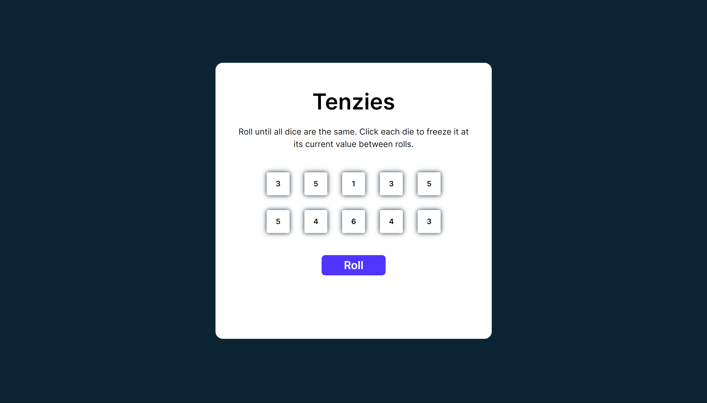
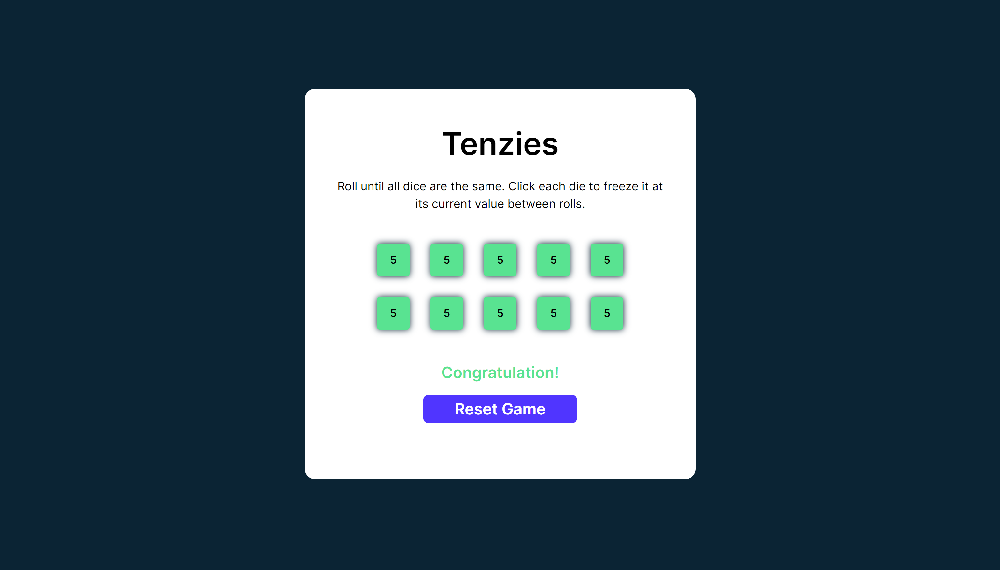

# Tenzies Game

This is just a small project that I have developed on my road to learning React. I got the idea for this project from [Scrimba](https://scrimba.com). It is one of the projects in the [Learn React](https://scrimba.com/learn/learnreact) course. While the stylings are referenced from the course, the entire React development is done by myself from scratch.

## Screenshot

## Links
- Live Site URL: [Netlify]()

## Built With

- CSS Custom Properties
- JavaScript
- React

## What I learned

This project helped me to understand React's basics such as how to create components, handle states, and handle side effects using React. However, this is just a small stepping stone for me to master React.

## How to Play

- Players can lock the value of the dice
- Players can roll to change the value of the dice
- Once players have locked all the dice and all dice have the same value, the game is won
- Reset the board to play the game again
